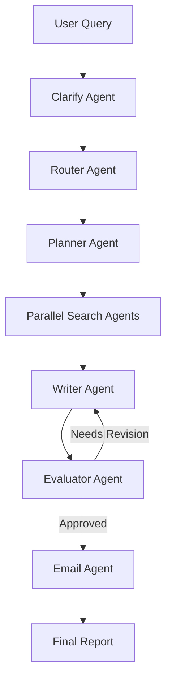
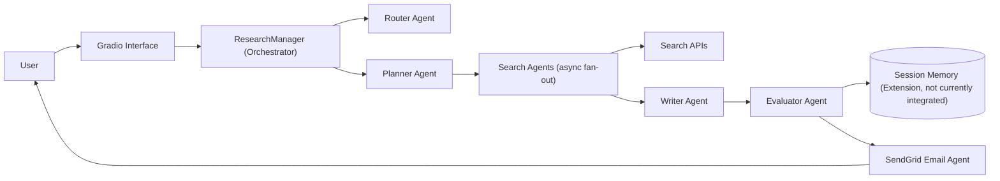

# Deep Research Workflow

Multi-agent research orchestration pipeline demonstrating five agentic workflow patterns for production-style AI systems engineering.

[](https://huggingface.co/spaces/cameronbell/deep-research-workflow)

## Architecture



## Services And Data Flow



## Problem

Manual deep research is slow, inconsistent, and hard to scale. Analysts must repeatedly search, synthesize, and validate across sources while balancing speed, quality, and cost.

## Solution

This repository implements an orchestration system that combines five patterns:

- Prompt chaining
- Routing
- Parallelization
- Orchestrator-worker
- Evaluator-optimizer loops

Together they provide structured planning, concurrent retrieval, iterative quality control, and cost-aware execution paths.

## Key Features

- Query routing into `quick`, `deep`, `technical`, and `comparative` paths
- Async concurrent search execution using `asyncio.as_completed`
- Structured outputs via Pydantic models for routing, planning, and evaluation
- Evaluator-feedback revision loop for complex reports
- Interactive clarification stage before execution

## Tech Stack

- Python 3.12+
- OpenAI Agents SDK
- Gradio
- Pydantic
- asyncio

## Project Structure

```text
.
├── app.py
├── deep_research_interactive.py
├── research_manager.py
├── router_agent.py
├── planner_agent.py
├── search_agent.py
├── writer_agent.py
├── evaluator_agent.py
├── clarify_agent.py
├── email_agent.py
├── demo_patterns.py
└── docs/
    ├── architecture.md
    ├── workflow-patterns.md
    ├── design-decisions.md
    └── evaluation.md
```

## Example Workflow Output

```text
Analyzing query type (auto-routing)...
Route: technical (specialized sources required)
Searches planned, starting to search...
Searches complete, writing report...
Evaluating report quality...
Report finalized, sending email...
```

## Results

Current evidence in this repo supports directional conclusions rather than fixed benchmark claims:

- Routing can reduce work for simpler queries by selecting lower-search paths
- Evaluator loops can improve report quality on complex queries through targeted revision
- Async search fan-out reduces wall-clock latency compared with sequential search execution

See reproducibility guidance in [docs/evaluation.md](docs/evaluation.md).

## Demo Assets

- Demo GIF placeholder: `assets/demo.gif` (to capture)
- Screenshot placeholders:
  - `assets/screenshots/01-query-input.png` (to capture)
  - `assets/screenshots/02-routing-status.png` (to capture)
  - `assets/screenshots/03-final-report.png` (to capture)

## Documentation

- [Architecture](docs/architecture.md)
- [Workflow Patterns Deep Dive](docs/workflow-patterns.md)
- [Design Decisions](docs/design-decisions.md)
- [Evaluation](docs/evaluation.md)
- [Implementation Summary (Historical, Evidence-Safe)](IMPLEMENTATION_SUMMARY.md)

## Run Locally

```bash
uv run python deep_research_interactive.py
```

Or run the Hugging Face entrypoint:

```bash
uv run python app.py
```

## Roadmap

- Add a reproducible benchmark harness for latency, token usage, and revision quality
- Capture and publish demo GIF and UI screenshots
- Add CI checks for docs link integrity and markdown validation
