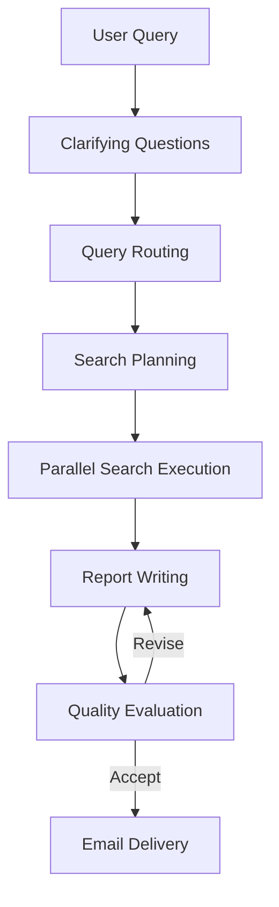
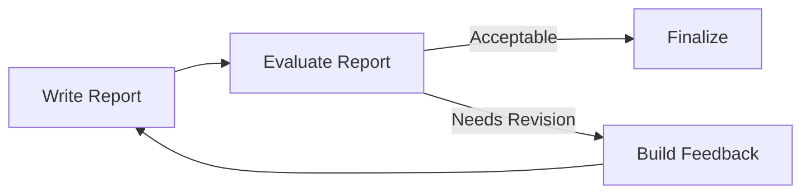

# Architecture

## Overview

Deep Research Workflow is an orchestrated multi-agent system where each agent has a narrow role and communicates through typed intermediate artifacts.

## End-to-End System Flow

## Agent Responsibilities

- `clarify_agent.py`: asks one context-aware clarifying question per step
- `router_agent.py`: classifies the query into `quick`, `deep`, `technical`, or `comparative`
- `planner_agent.py`: produces structured `WebSearchPlan`
- `search_agent.py`: executes individual web search tasks
- `writer_agent.py`: synthesizes findings into `ReportData`
- `evaluator_agent.py`: scores and critiques report quality
- `email_agent.py`: sends finalized report
- `research_manager.py`: orchestrates sequencing, fan-out, retries, and revision loop

## Async Concurrency Points

Parallel retrieval is implemented in `research_manager.py` by creating search tasks and consuming them with `asyncio.as_completed`, which yields early completions and improves total wall-clock time over serial execution.

## Evaluator Loop

The revision loop is bounded by `MAX_REVISION_ATTEMPTS` to cap cost and runtime.

## Interfaces and Data Contracts

Typed models define handoffs:

- `QueryRoute` (`route`, `reasoning`, `num_searches`)
- `WebSearchPlan` and `WebSearchItem`
- `ReportData`
- `ReportEvaluation` (`is_acceptable`, `issues`, `suggestions`, `score`)

These contracts reduce ambiguity and make orchestration behavior auditable.
